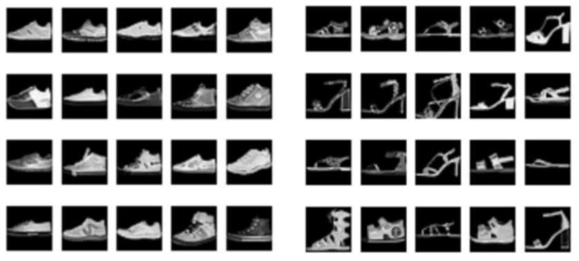
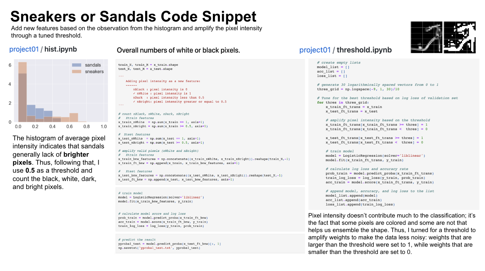

# Sneakers or Sandals		
 

**Technologies Used**: Python, scikit-learn, pandas, Jupyter Notebook   
**Responsibilities**
- Explore feature transformations (partial histograms, pixel intensity, spatial pattern)
- Utilize data augmentation in classifying data
    

## Project Bio

This is the repo to host my work on feature tuning for sneakers and sandals, after doing a close analysis on 8 and 9 images. I trained models on sneakers and sandals input image, and examine the model by making predictions on the given test data.  

[Image data](https://github.com/irina-wang/tufts/tree/main/cs135-machine-learning/work/project01/data_sneaker_vs_sandal) are 28 × 28 pixel array with gray-scale values between 0.0 (black) and 1.0 (white). 

## Project Snapshots

Detailed processing and thought process can be found in the [final report](https://github.com/irina-wang/tufts/blob/main/cs135-machine-learning/work/project01/final/project01.pdf)